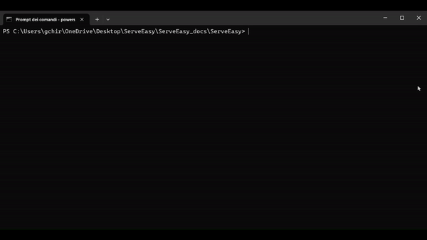
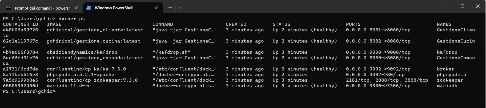
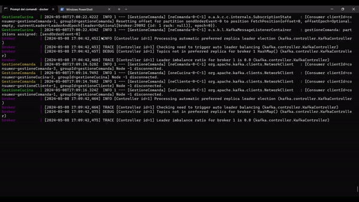
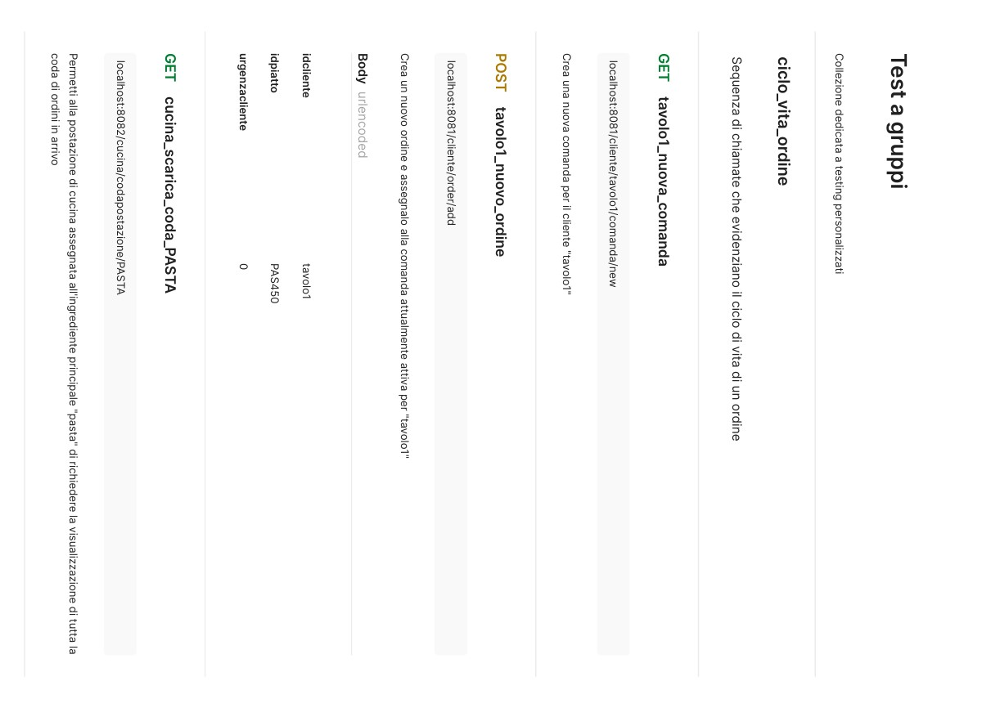
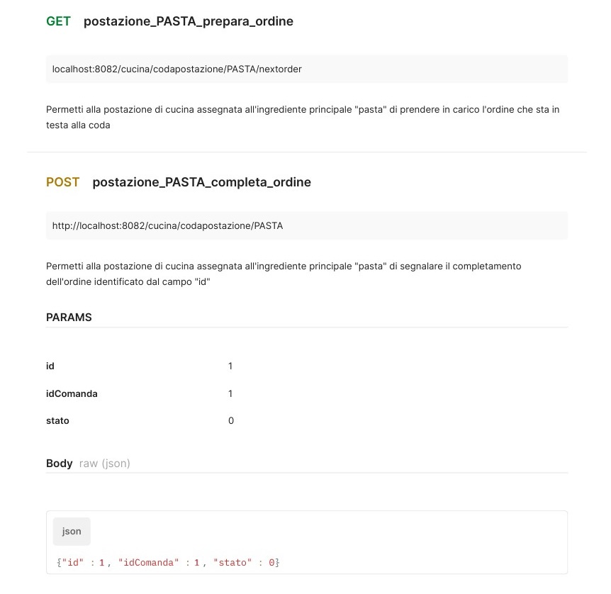

### Deploy del sistema a microservizi utilizzando Docker Compose 

Prima di procedere è necessario scaricare Docker Desktop (Windows) o Docker Engine (Linux, Mac).

Per scaricare le dipendenze ed avviare la rete di microservizi, aprire una riga di comando nella cartella contenente il <i>docker-compose.yaml</i> e digitare il comando:
```shell
docker compose up
```


Durante il caricamento, verifica la salute della rete. Apri una riga di comando e digita:
```shell
docker ps
```
Puoi interagire col sistema non appena vedi solo "healthy" di fianco ai servizi interessati.

Per disattivare la rete e rimuovere i container si può procedere con la combinazione tasti <kbd>Ctrl</kbd> + <kbd>C</kbd> oppure, con una riga di comando nella cartella contenente il <i>docker-compose.yaml</i> digitare il comando:
```shell
docker compose down
```


Se invece si volessero mantenere i container per riattivarli successivamente si può utilizzare il comando
```shell
docker compose stop
```

<br>

### Testing della demo
Di seguito vengono riportate delle chiamate di prova per il collaudo. Le chiamate documentate e pubblicate su Postman sono disponibili [qui](https://documenter.getpostman.com/view/20761533/2sA3JKcN1D).

Ai fini della demo è stato incluso un file reset_db.bat per eliminare i dati del database, <b>da usare solamente prima o dopo l'avvio della demo</b> .


